# Hyperconvergence setup on a single node


This document takes you through how you can setup a hyperconverged environment on your laptop or machine.


The objective of this document is to become familiar with the concepts of a
hyperconverged environment and gather a basic understanding of the steps
involved in setting one up. An ideal hyperconverged environment however
requires a minimum of three nodes or physical machines.
Pre-requisities: A laptop / system with CentOS 7 installed.


We will be using CentOS 7 as the operating system, oVirt 3.6 for the
virtualization manager and GlusterFS 3.7.11 as our filesystem.


The machine needs to have a wired network connection, which our setup will be accessing.


1) To start with, let's update our packages using:

```
yum update
```

Doing this ensures that we have all the latest repositories to work with. Not
doing so may result into us arriving at a situation where we can't install a
package due to a particular repository not being available.


2) Next, we have to install the oVirt 3.6 release package:

```
yum install http://resources.ovirt.org/pub/yum-repo/ovirt-release36.rpm
```


3) Install screen, oVirt hosted engine and then install vdsm package to run the hosted engine:

```
yum install screen ovirt-hosted-engine-setup vdsm-gluster
```

oVirt engine is an application which runs as a web service. It talks to VDSM to
request VM related actions on the host machine such as deploying, starting,
stopping and monitoring VMs. It can also create new VM images on storage from
templates.


4) Start gluster service

```
systemctl start glusterd.service
```

5) Our setup will be using the following ports:


| Port Number | Usage |
|-------------|-------|
| 111 | Remote Procedure Call |
| 2049 | Network File System |
| 54321 | VDSM (Red Hat Gluster Storage Console) |
| 5900 | Remote Frame Buffer Protocol |
| 5666 | NRPE |
| 1651 | Transport Layer Security Protocol |
	

We run the following commands to ensure that our ports are accessible:

```
firewall-cmd --zone=public --add-service=glusterfs --permanent
firewall-cmd --zone=public --add-port=111/tcp --permanent
firewall-cmd --zone=public --add-port=2049/tcp --permanent
firewall-cmd --zone=public --add-port=54321/tcp --permanent
firewall-cmd --zone=public --add-port=5900/tcp --permanent
firewall-cmd --zone=public --add-port=5900-6923/tcp --permanent
firewall-cmd --zone=public --add-port=5666/tcp --permanent
firewall-cmd --zone=public --add-port=16514/tcp --permanent
firewall-cmd –reload
```

The reload command will reload all firewall rules and save our settings for the
duration of this setup, so that we have access to the mentioned ports.


6) In this tutorial, we will be needing a storage volume to store virtual
instances or images that we create. We won't be writing any data at this stage.
We are using GlusterFS to create this volume. (Note that in case we were to
write data, we would be in need of another volume, which would make it two
volumes in all.)

Now, we need to have three bricks in order to create a Gluster volume - three
bricks because we are simulating creating a Gluster volume using three hard
disks on three physical machines.

We can create these bricks simply by creating three directories using the following commands:

```
mkdir -p /brick/b1
mkdir -p /brick/b2
mkdir -p /brick/b3
```

Using these commands, we have created a directory called **brick** under root,
and under it, three directories b1, b2 and b3.

7) Let's create a volume using our three bricks/directories!

```
gluster volume create engine replica 3 10.209.65.225:/brick/b1 10.209.65.225:/brick/b2 10.209.65.225:/brick/b3
```

We are naming our gluster volume as **engine**.

`10.209.65.225` is the IP of our host machine. We can view this using the `ip addr` command.

8) We have to now run some commands in order to make our volume ready to store **virtual instance images**.

```
gluster volume set engine group virt
```

What this command does is set the volume to use options in the "virt" file.
This file becomes available on your system when you install the required rpms
above. The options in the file are recommended for performance reasons, when
implementing virtualisation.

Note that after using this command, it's not advisable to use the volume to
store anything other than virtual instance images.

9) Adding permissions / ownership to our volume:

```
gluster volume set engine storage.owner-uid 36
gluster volume set engine storage.owner-gid 36
```

10) Using the shard feature:

```
gluster volume set engine features.shard on
gluster volume set engine features.shard-block-size 512MB
```

Sharding is a method or a feature that GlusterFS uses to store large files. The
above command will cut the file into blocks of 512 MB each for storing them
across the volume.


11) Following this, we need to execute a command so that

```
gluster volume set engine performance.low-prio-threads 32
```

Each brick in a Gluster volume has an io-threads translator that schedules
operations on IO threads. What this command does is assign a maximum of 32 IO
threads to perform low priority tasks such as that of writing. Other threads
perform high priority tasks such as that of performing lookups or reading
metadata.


12) We now specify an algorithm for data self heal.

```
gluster volume set engine cluster.data-self-heal-algorithm full
```

As we have created a replicated gluster volume, data will be replicated across
all three bricks of the volume. In the event in which any one brick goes down,
data will be stored on the other two bricks but when this brick comes back up,
the data on it needs to be synchronised with that on the other two bricks,
which means that this brick needs to have updated data. The operation that does
this is called as “self healing” and there are many algorithms that one can use
to perform self healing of data. Here, we specify an algorithm called as “full”
for self healing of data. This algorithm will read all the data and write it
all to the brick as opposed to some other algorithms such as “diff” which will
only write the differences after performing a checksum on the data.

For self healing of metadata however, there is just one algorithm used, so we
don't specify any command for it here.


13) Start the volume

```
gluster volume start engine
```

## Hosted Engine Setup


This section will focus on installing oVirt engine appliance that will take
care of tasks such as creating a VM, installing the ovirt engine setup on it
etc.


Run this command to install ovirt-engine-appliance on your laptop or host:

```
yum install ovirt-engine-appliance
```


```
screen
```

The `screen` command will open up a new terminal for us to work on. The advantage of
using the screen terminal is that in case of a network disruption, our process
will resume from the last restore point and not get completely halted. Screen
also has many other advantages such as we can locally and remotely attach and
detach a screen session whenever we want to, and also have multiple screens.
The processes on the screen will run in the background, even if you detach a
screen session. You can always attach it back whenever you want to work on it.


```
hosted-engine –-deploy
```

This launches the setup which involves creating a VM and preparing it to install oVirt.


Through the course of this setup, you will come across a lot of options to
choose from with a default option suggested to you in square brackets. Pressing
**Enter** without selecting an option will imply that you wish to go ahead with
the default option.
We'll do that for most options.
Now,

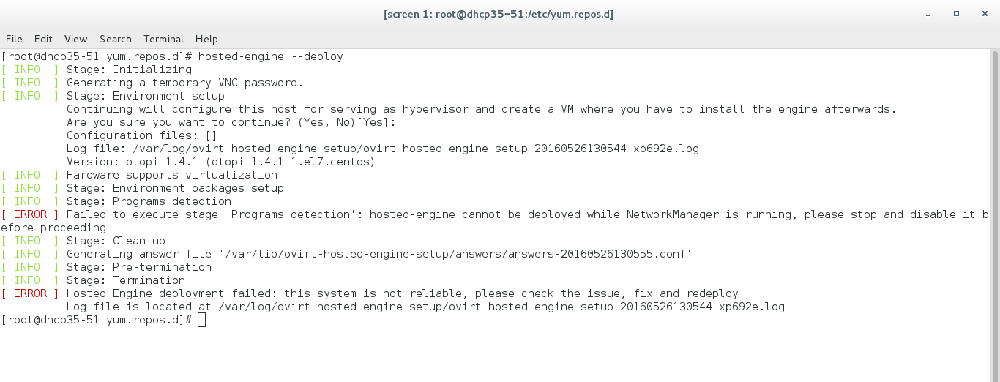

Running the `hosted-engine –deploy` command when the NetworkManager service is
running may result into an error such as the above, and stop execution.

We need to stop this service to proceed.  

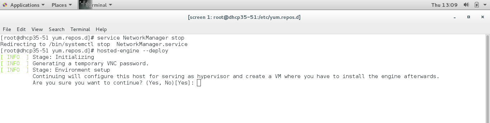  

Pressing the 'Enter' key here without typing 'Yes' will result into it
accepting the default 'Yes' option in the square brackets.    

-----

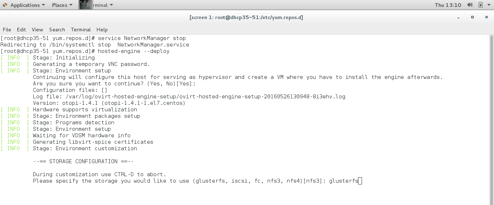

Here, we don't want to select the suggested default option **nfs3**. Instead, we
type in **glusterfs** as our preferred storage.  

-----  


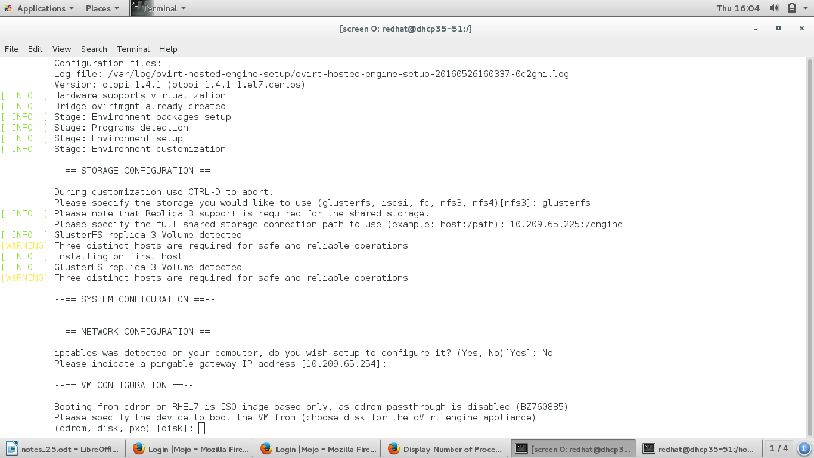

We enter the volume path (10.209.65.225:/engine in our case) and proceed. For
configuring IP tables, we say 'No', this is a temporary workaround as saying
'Yes' results into gluster ports being left unopened.  

-----

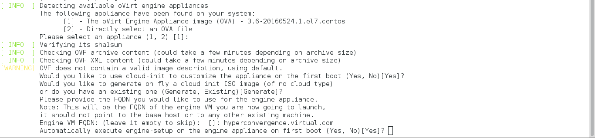

The Engine VM FQDN name “hyperconvergence.virtual.com” is a dummy DNS name that
we give at this stage, after adding an entry of this in the /etc/hosts file of
our system, against a dummy IP address. We'll replace this IP address with that
of the VM's IP address in further steps.  

-----

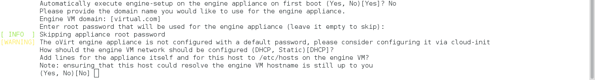

We want to configure oVirt with both Virt and Gluster mode. Automatically
executing engine setup configures oVirt in Virt mode alone. So, when we're
asked if we want to automatically execute engine setup, we say 'No' and proceed
with the other default options.  

-----

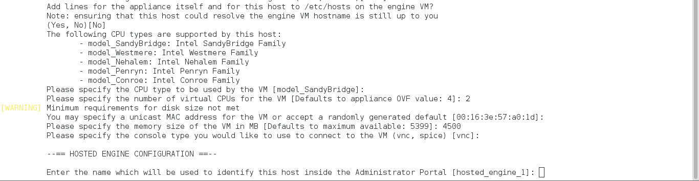

We enter the number of CPUs and memory and accept the suggested name for our
machine `('hosted_engine_1')`.  

-----

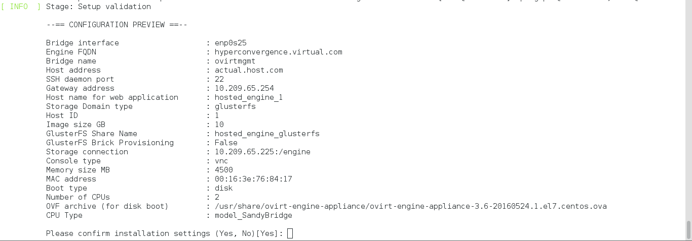

-----


-----

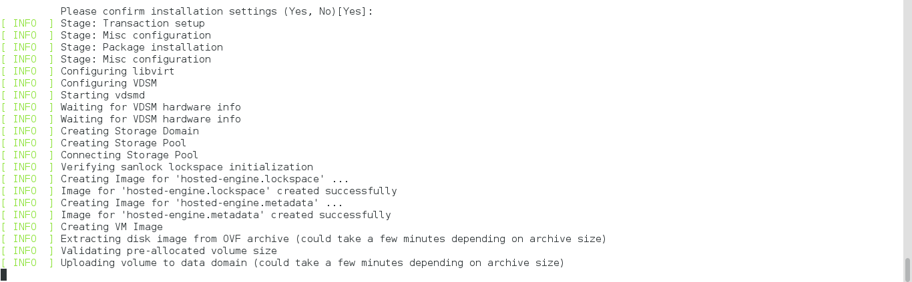
 
 
We choose to 'Continue Setup' and proceed.  
  
-----

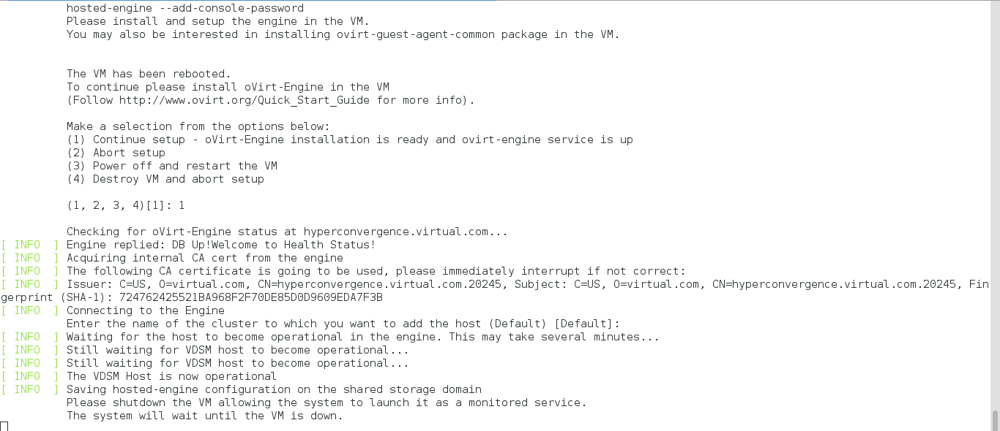

At this stage, we have to login to our VM that our hosted engine setup created,
to install oVirt on the VM. We do this because we chose to NOT run engine setup
automatically in one of the previous steps. 


We login to the VM by running the following command on a new terminal:

```
remote-viewer vnc://10.209.65.225:5900
```

`10.209.65.225` is the IP of our hostmachine and `5900` is the port number
required for remote access to our VM.  


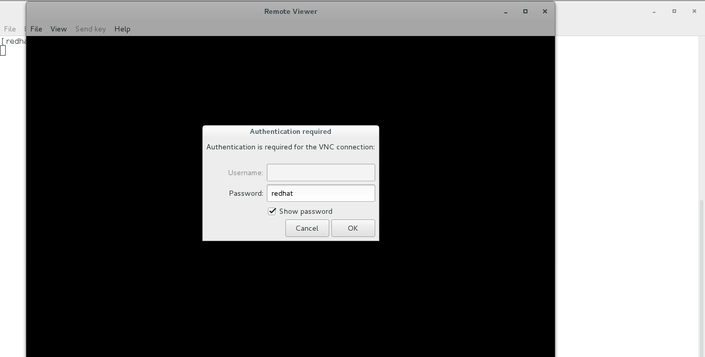

We enter the password that we set before.    

-----

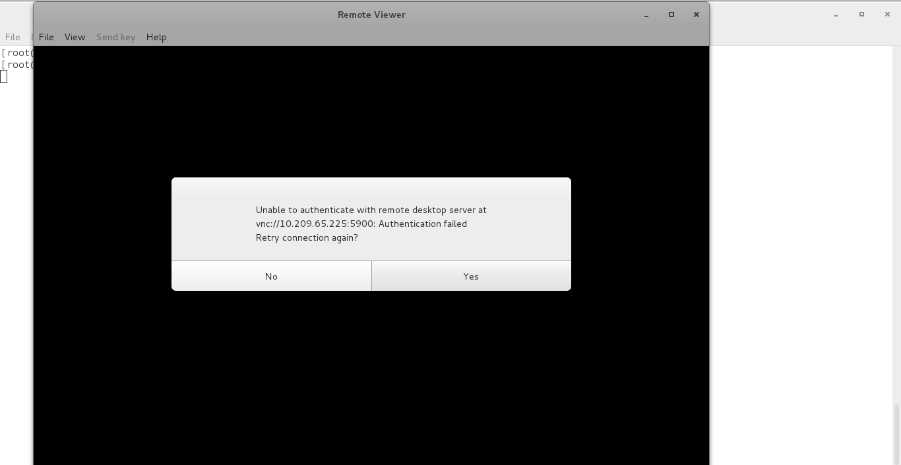

Sometimes, you may encounter an authentication failure such as the one above. 

In this case, you have to close the remote viewer, come back to your terminal
where you entered the command for remote viewing, and enter the following
command:

```hosted-engine –add-console-password```


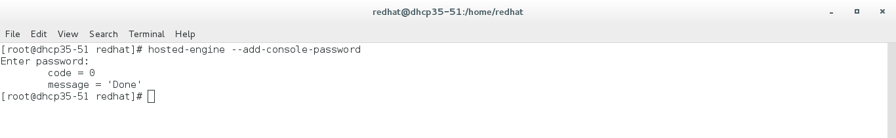

Setting the password here and then running the remote viewer command again
should result in successful login.  

-----

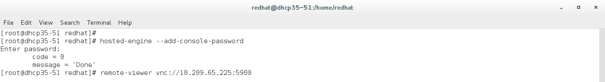

-----

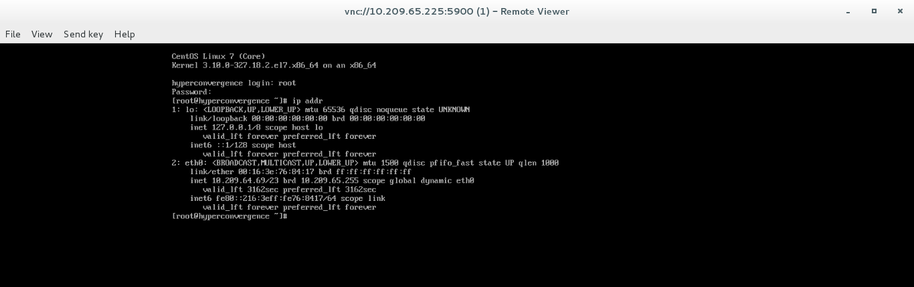

Once the VM is launched, entering the 'ip addr' command will help us know the
IP of the VM.
Once the IP of our VM is obtained, we correct the entry in the /etc/hosts file
of our host machine, where we entered a dummy IP earlier. 


At this point, we should have two entries in our /etc/hosts file - one pointing
to our local host machine and the other one to our VM.
We'll copy both these entries and paste them in the /etc/hosts file of the VM.
We have to now run 'engine-setup' on this VM (terminal) using the command
'engine-setup' and once it's complete, we go back to the terminal on our host
machine to continue with the rest of the setup.  

-----

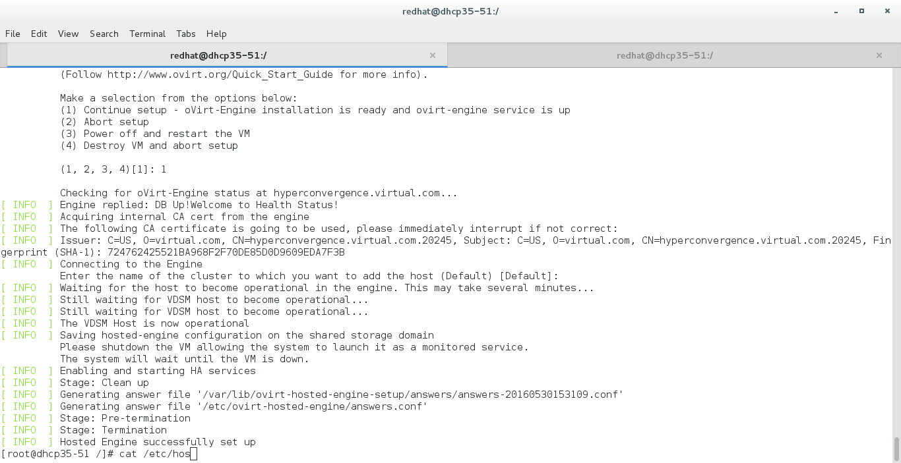


Once Hosted-engine setup is successfully complete, you can login to the
virtualization manager using the IP of the VM.    
 
-----


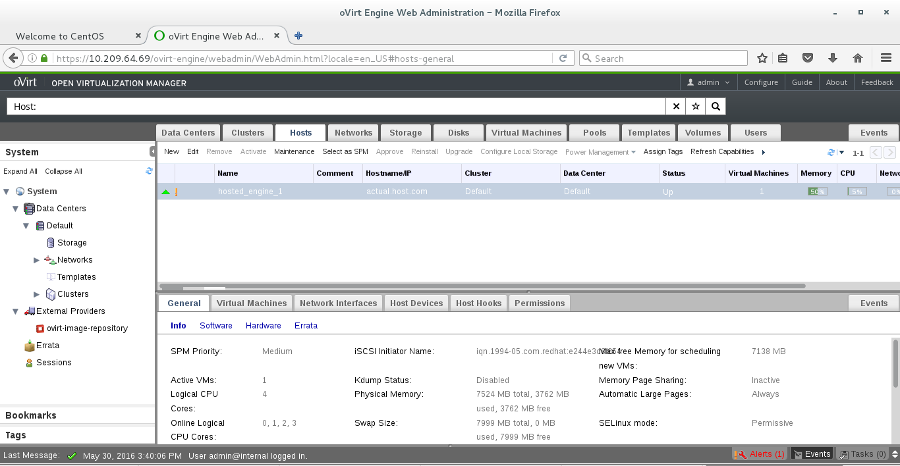

The setup is successful. You can use this web service to manage VMs across all
the nodes in an ideal setup. For this tutorial, we just have one.
